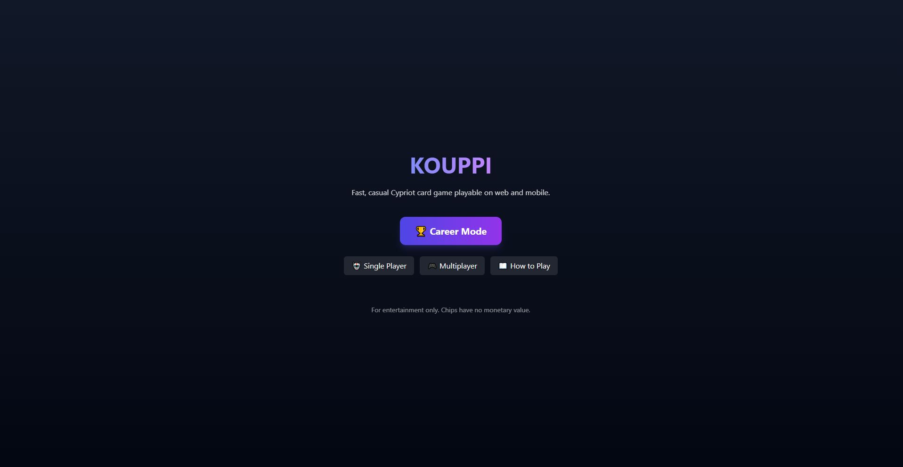
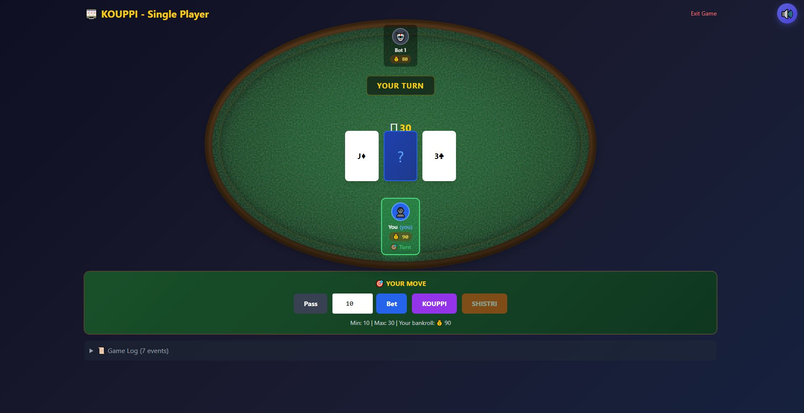
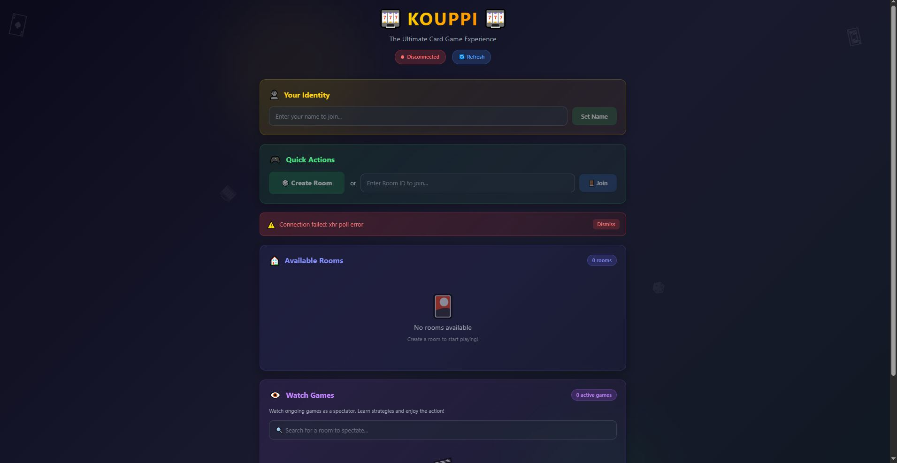
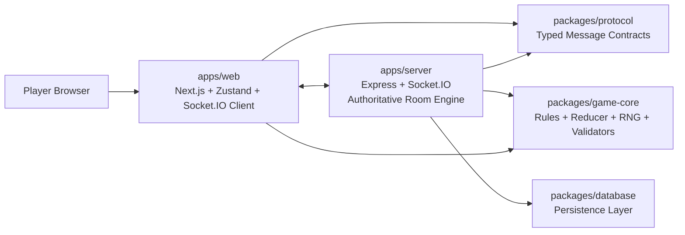
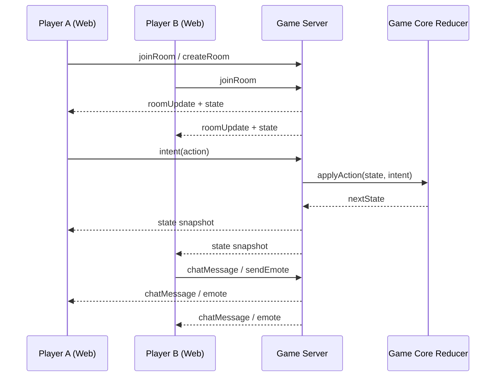

# KOUPPI

A modern web implementation of Kouppi, built as a full-stack multiplayer card game with a monorepo architecture.

## Live Production

- Website: https://kouppi-web-nektarios-is-projects.vercel.app
- Latest ready deployment: https://kouppi-22utiiyru-nektarios-is-projects.vercel.app
- Repository: https://github.com/Nektarios-I/Kouppi

## Project Story

This project was created as a focused learning experiment to harness agent-assisted development workflows.

It was built in a short timeframe using a vibe-coding approach, while still applying core software engineering principles:

- Separation of concerns across web, server, protocol, game logic, and data layers.
- Incremental implementation with gradual, test-backed delivery.
- Precise iteration loops with continuous validation.

The goal was to move fast without collapsing architecture quality.

## Screenshots

### Home



### Single Player



### Multiplayer



## Core Features

- Single player and multiplayer game modes.
- Real-time room-based multiplayer over Socket.IO.
- Spectator mode with live room updates.
- Lobby flow with room discovery and creation.
- Chat and emote systems in multiplayer rooms.
- Player avatars and room presence state.
- Turn timer and round decision flow (stay/leave).
- Career mode foundations (auth, queueing, progression modules).
- Type-safe protocol messaging package.
- Shared game-core package with reducer/invariant tests.

## Architecture Overview



## Real-Time Game Flow



## Monorepo Structure

```text
apps/
  web/         Next.js frontend
  server/      Express + Socket.IO backend
packages/
  game-core/   Shared game logic and rules
  protocol/    Shared typed multiplayer message contracts
  database/    Persistence abstractions
docs/
  Career mode research and multiplayer logs
photo/
  Project screenshots used in this README
```

## Tech Stack

- Frontend: Next.js 14, React 18, Tailwind CSS, Zustand, Socket.IO Client
- Backend: Node.js, Express, Socket.IO, Zod, JWT
- Shared packages: TypeScript, Turbo, pnpm workspaces
- Testing: Vitest, Testing Library, Playwright (optional e2e setup)
- Deployment: Vercel

## Getting Started

### Prerequisites

- **Node.js 20 LTS** (required). Node 23+ / 25 will break `better-sqlite3` native bindings.
- pnpm 10.12.4 (see `packageManager` in root `package.json`)

On Windows, if your default `node -v` is not 20.x, activate the bundled toolchain first:

```powershell
. .\scripts\use-node20.ps1
```

### Install

```bash
pnpm install --frozen-lockfile
```

### Run all apps in dev mode

```bash
pnpm dev
```

Or separately (two terminals, after `use-node20.ps1` on Windows):

```bash
pnpm --filter @kouppi/server dev
pnpm --filter @kouppi/web dev
```

### Build everything

```bash
pnpm build
```

### Test everything

```bash
pnpm test
```

## Useful Commands

| Command                             | Purpose                           |
| ----------------------------------- | --------------------------------- |
| `pnpm dev`                          | Run all workspace dev processes   |
| `pnpm build`                        | Build all packages/apps via Turbo |
| `pnpm lint`                         | Run lint tasks                    |
| `pnpm test`                         | Run test suites                   |
| `pnpm --filter @kouppi/web build`   | Build web app only                |
| `pnpm --filter @kouppi/server test` | Run server tests only             |

## Quality and Validation

The repository includes test coverage at multiple layers:

- Server room and socket tests.
- Game-core reducer and invariant tests.
- Protocol message validation tests.
- Web lobby behavior tests.

This multi-layer approach helps keep rapid iteration safe.

## Deployment Notes

- Production deploy target: Vercel project `kouppi-web`.
- GitHub auto-deploy is configured for `main`.
- Root directory in Vercel is set to `apps/web`.
- Enable **Include source files outside of the Root Directory** (monorepo) in Vercel project settings.
- `apps/web/vercel.json` installs from the repo root and runs `turbo build --filter=@kouppi/web` so `@kouppi/game-core` and `@kouppi/protocol` are compiled before Next.js (their `dist/` folders are not committed).

For manual production deploy from the web app folder:

```bash
npx vercel deploy --prod --archive=tgz
```

## Engineering Principles Used

This project intentionally emphasizes:

- Separation of concerns between UI, transport, rules, and persistence.
- Authoritative server-side game state for multiplayer integrity.
- Incremental implementation and progressive hardening.
- Practical type safety and shared contracts across client and server.

## Roadmap

- Expand career mode progression and ranked matchmaking.
- Improve reconnect and resilience flows.
- Add richer telemetry and gameplay analytics.
- Expand e2e coverage for multiplayer paths.

## Game Server (Production)

The multiplayer Socket.IO server (`apps/server`) must run on a **persistent host** (not Vercel serverless). Step-by-step deployment: [docs/GAME_SERVER_DEPLOY.md](docs/GAME_SERVER_DEPLOY.md). Optional Render blueprint: [`render.yaml`](render.yaml).

Suggested env:

| Variable | Purpose |
|----------|---------|
| `PORT` | HTTP + Socket.IO port (default `4000`) |
| `CORS_ORIGIN` | Allowed web origin (your Vercel URL) |
| `JWT_SECRET` | Auth signing secret |
| `DATABASE_PATH` | SQLite file path on a mounted volume |
| `REDIS_URL` | Optional — enables Socket.IO cluster adapter, shared room store, and friend presence when `redis` + `@socket.io/redis-adapter` are installed on the host |

Logged-in friends games persist session stats to SQLite when a room closes (`GET /api/casual/stats`). Guest-only tables are not stored.

Friends system (logged-in): `GET/POST/DELETE /api/friends/*`, socket events `friends:auth`, `friends:invite`, `friends:presence`. Lobby shows a Friends panel when signed in.

## Contributing

Issues and pull requests are welcome.

If you want to contribute, start by opening an issue that describes:

- the problem or feature,
- expected behavior,
- and a proposed implementation direction.

## License

This repository is licensed under the terms in [LICENSE](LICENSE).
